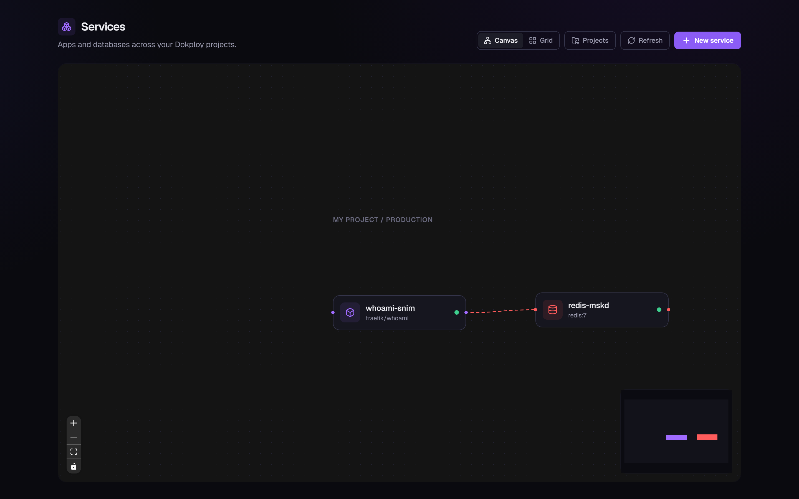

# Switchyard

**Switchyard** is an open-source, Railway-style PaaS built on top of
[Dokploy](https://dokploy.com) and driven by
[Claude Code](https://claude.com/claude-code): deploy databases, apps, and
compose stacks onto your own machine or server, manage them from one canvas,
and let Claude Code operate the platform through MCP.

Five pieces live here:

- **The dashboard** (`dashboard/`) — a Railway-style UI over the Dokploy API:
  one canvas for every service, one-click databases, app deploys from a Docker
  image / Git repo / GitHub App / 476-template catalog, per-service management
  drawer, live + persisted logs/metrics — behind a per-user Dokploy login.
- **The desktop app** (`desktop/`) — the one-click install for Windows/macOS:
  double-click, and the window becomes your dashboard with the stack running
  underneath. Installs Docker Desktop for you if it's missing.
- **The CLI** (`cli/`, npm **`switchyard-cli`**) — the one-command installer
  that converges the whole stack.
- **Launch tooling** (`Makefile` + `scripts/`) — idempotent install of the
  Dokploy stack (Swarm + Traefik) on Linux hosts, including workarounds for
  hostile environments (no systemd, no IPVS, registry rate limits).
- **The MCP server** (`mcp/`) — Dokploy operations as Model Context Protocol
  tools, so Claude Code can deploy apps, provision databases, and read logs
  without dashboard clicks.



## Quick setup

### Windows & macOS — the desktop app (easiest, no terminal)

You don't need Docker, Node.js, or any command line — the app handles
everything.

1. **Download** `Switchyard-Setup-<version>.exe` (Windows) or
   `Switchyard-<version>.dmg` (macOS) from the
   [latest release](https://github.com/sbdeals/Switchyard-The-Open-Source-Railway-Alternative/releases/latest).
   (No installer on the latest release yet? It ships with the next tag — or
   build it yourself: `cd desktop && npm install && npm run dist`.)
2. **Run it.** The build isn't code-signed yet, so Windows SmartScreen may warn
   you — click **More info → Run anyway** (macOS: right-click → Open).
3. **First run only:** if Docker Desktop isn't installed, a setup wizard offers
   to download and install it for you — click **Install Docker Desktop for
   me**, approve the administrator prompt, and wait. (Docker is the engine
   Switchyard runs your apps in; it's the one thing that can't be bundled. If
   Windows asks to restart, restart and open Switchyard again — it picks up
   where it left off.)
4. **Wait for the progress screen** to tick through engine → services →
   dashboard. The first run downloads container images (a few minutes on
   ordinary broadband); every run after that takes seconds.
5. **That's it.** The window becomes your dashboard, already signed in. Deploy
   your first app from the canvas: one-click databases, Docker images, Git
   repos, or the 476-template catalog.

Day to day it lives in the system tray: open the dashboard, stop/start the
stack, reset everything, launch at login (on by default, so it's always warm),
and auto-update. Closing the window keeps everything running; "Quit" does too —
your apps only stop if you ask for **Stop stack**.

Source lives in [`desktop/`](desktop/) — it drives the exact same converge
logic as the CLI below, so the app and `switchyard up` can be used
interchangeably on the same machine.

### Linux (server or desktop)

Prerequisites: a 64-bit distro and `curl`. Docker and Node.js are installed
automatically if missing:

```bash
curl -fsSL https://raw.githubusercontent.com/sbdeals/switchyard/main/install.sh | bash
```

Already have Node 20+ and Docker? Skip the bootstrap:

```bash
npx switchyard-cli up
```

### Windows 11 (and macOS)

Prerequisites:

1. **Docker Desktop** installed and running (WSL2 backend on Windows).
2. **Node.js 20+** (`node --version`).

Then:

```bash
npx switchyard-cli up
```

On desktop machines, deployed apps get local URLs like
`http://<app>.localhost` — browsers resolve `*.localhost` to your machine with
no DNS setup. (Public wildcard-DNS names like sslip.io often *don't* work on
home networks: many routers block DNS answers that point at 127.0.0.1.)

### What you get

Every path stands up Dokploy, creates the admin account for you (the CLI asks
in the terminal; the desktop app generates one and signs you in — no browser
round-trip, no env files either way), and runs the Switchyard dashboard as a
managed container on http://127.0.0.1:3001. The CLI additionally offers to set
up Claude Code:

| Piece | Where |
|---|---|
| Switchyard dashboard | http://127.0.0.1:3001 (per-user Dokploy login) |
| Dokploy | http://localhost:3000 (Linux default) |
| Traefik ingress | ports 80/443 (image `traefik:v3.6.7`) |

Re-running `up` is safe — it converges, and upgrades when a newer version is
out. Settings are changed *after* setup with
`switchyard config set <key> <value>`. Full reference: [docs/cli.md](docs/cli.md).

> The npm package is **`switchyard-cli`** (the bare npm name `switchyard` is an
> unrelated squatted package — don't `npx switchyard`).

> Pin Traefik at v3.5+ (we ship v3.6.7). Traefik v3.1.x's docker/swarm
> providers speak Docker API 1.24, which Docker engines ≥ 29 reject — routes
> silently never load.

**Manual / contributor path**: `make up` on Linux plus the dev-mode dashboard
(`npm run dev`) — see [docs/getting-started.md](docs/getting-started.md).
Other targets: `make down` (`PURGE=1` wipes data), `make claude` (launch
Claude Code here), `make doctor` (check prerequisites).

## Switchyard at a glance

- **Unified canvas** — databases, applications, and compose stacks as draggable
  nodes (React Flow) in a compact grid, with connection arrows inferred from
  env vars, a minimap, and per-browser persisted layout. Grid and per-project
  views included.
- **Databases** — Postgres, MySQL, MariaDB, MongoDB, Redis: one-click deploy,
  connection strings, env editor, resource/version/port settings, and
  **backups** (S3 destinations, cron schedules, back-up-now, restore).
- **Applications** — deploy from a Docker image, a public Git repo, or a
  **private repo via the GitHub App**; browse and one-click deploy Dokploy's
  **template catalog** (476 apps — Supabase, n8n, Grafana, WordPress, …);
  configurable **builds** (Nixpacks / Dockerfile / Railpack / Static /
  buildpacks, start command, private registry); public URLs on deploy;
  **custom domains** with edit/delete + auto-SSL; variables; **cron
  schedules**; deployment history with **rollback** and per-app
  **push-to-deploy webhooks**.
- **Compose stacks** — full parity with apps: in-app YAML editor, variables,
  domains (routed per compose service), deploy history, volumes, metrics,
  logs, console.
- **Per-service drawer** — Overview (public URL + private-DNS hostname +
  lifecycle), Variables, **Deploy** (replicas, restart policy, healthcheck),
  Build, **Networking** (domains, proxy redirects, published ports, HTTP
  basic-auth), Deploys, Schedules, Volumes, **Metrics** (CPU/memory, live +
  history), Logs, **Console** (run commands inside the container), Settings
  (limits + reservations, danger zone).
- **Live logs & metrics** — streamed from the Docker Engine API over SSE, plus
  **persisted metric history** and **crash-loop alerts** through Dokploy's
  notification channels.
- **Projects & environments** — create, rename, delete from the dashboard.
- **Login required** — users sign in at `/login` with their Dokploy account
  (sign-up supported); every route, Server Action, and log/metric stream is
  gated.
- **MCP server** (`mcp/`) — Claude Code can drive the platform directly:
  deploy images/repos/compose, provision databases, manage env/domains, read
  logs/metrics. Registered in `.mcp.json`, so `make claude` picks it up.

> **Security note:** the dashboard requires a Dokploy login, but a login gate
> is not TLS — and a valid login still grants full Dokploy admin. Keep it on
> localhost (the default) or put an HTTPS proxy in front before `--expose`.

*(Some screenshots predate the newest tabs — refreshing them is a TODO.)*

## Documentation

| Doc | What's inside |
|---|---|
| [CLI reference](docs/cli.md) | `switchyard up/config/status/...` — the one-command install, every flag, config keys, migration notes |
| [Getting started](docs/getting-started.md) | The fast path on all platforms, plus the manual installs (Linux `make up`, Windows Docker Desktop) and the verification checklist |
| [Dashboard guide](docs/dashboard-guide.md) | Feature tour with screenshots |
| [Architecture](docs/architecture.md) | The BFF design, data model, SSE logs/metrics, canvas internals |
| [Launch tooling](docs/launch-tooling.md) | Every make target and script, and why they exist |
| [Troubleshooting](docs/troubleshooting.md) | Symptom → cause → fix, for both platforms |

## Repo layout

```
install.sh             # curl-able bootstrap: Docker + Node if missing, then `npx switchyard-cli up`
cli/                   # the switchyard CLI (npm: switchyard-cli) — up/status/down/config/doctor/...
Makefile               # up / status / down / claude / doctor
scripts/               # bash launch tooling (Linux hosts; also bundled inside the npm package)
  lib.sh               #   shared helpers: dockerd, mirror, advertise addr, waits
  dokploy-up.sh        #   install + launch Dokploy (idempotent)
  dokploy-status.sh    #   stack status + dashboard URL
  dokploy-down.sh      #   stop the stack (--purge to wipe data)
  claude-up.sh         #   launch Claude Code in this repo
  doctor.sh            #   prerequisite / environment check
  local-ingress.sh     #   opt-in Traefik ingress for Docker Desktop (HTTP-only demo)
dashboard/             # Switchyard dashboard (Next.js 16 + TypeScript + Tailwind v4) + Dockerfile
mcp/                   # MCP server: Dokploy ops as tools for Claude Code (.mcp.json registers it)
docs/                  # documentation (see table above) + screenshots
```

## Environment notes

The launch scripts encode two workarounds that stock installers miss on
sandboxed hosts: a Docker Hub pull-through mirror (rate-limited shared egress
IPs) and `--endpoint-mode dnsrr` on every Swarm service (kernels without IPVS
can't route service VIPs). Details and symptoms live in
[docs/launch-tooling.md](docs/launch-tooling.md) and
[docs/troubleshooting.md](docs/troubleshooting.md).

## Roadmap

- [x] Install and launch Dokploy on this host
- [x] One-command launch for Dokploy and Claude Code
- [x] Railway-style dashboard on top of the Dokploy API: databases,
      applications, compose, projects, canvas, live logs/metrics
- [x] One-command install for the whole stack (`curl … | bash` /
      `npx switchyard-cli up`): terminal-guided admin setup, dashboard as a
      managed container, post-setup `switchyard config`
- [x] Dashboard auth — per-user Dokploy login gating every route and stream
- [x] Push-to-deploy webhooks and image-snapshot rollback in the Deploys tab
- [x] Backups: S3 destinations, schedules, manual runs, restore
- [x] Observability persistence (switchyard-metrics Postgres) + crash-loop
      alerts via Dokploy notifications
- [x] MCP server so Claude Code drives Dokploy directly (`mcp/`, `.mcp.json`)
- [x] Private-repo deploys via the Dokploy **GitHub App**
- [x] Dokploy **template catalog** in the New-service menu
- [x] **Build config**, **cron schedules**, and **volume mounts** per service
- [x] **Custom-domain management** + local ingress for Docker Desktop
      (`<app>.localhost` URLs, Traefik v3.6.7)
- [x] Railway-parity drawer: **Networking** (redirects/ports/basic-auth),
      **Deploy** (replicas/restart/healthcheck), **Console** (in-container
      commands), full **compose parity** (variables/domains/deploys/metrics)
- [ ] HTTP metrics (traffic / requests / error rate / latency percentiles)
      from Traefik
- [ ] In-dashboard Claude agent with staged-approval for destructive actions
- [ ] Per-deployment build logs in the dashboard
- [ ] TLS for the dashboard itself (today: localhost default / HTTPS proxy for
      exposure); real Let's Encrypt custom domains need a Linux host on 80/443
