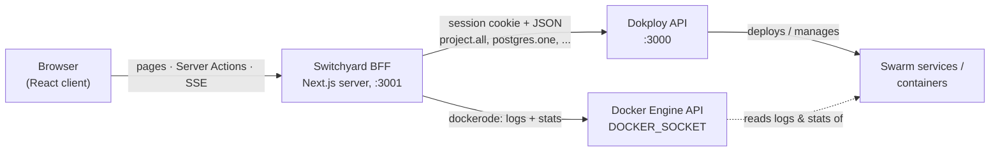

# Architecture

This doc explains how **Switchyard** — the Next.js dashboard in [`dashboard/`](../dashboard/) — is put together: the backend-for-frontend over the Dokploy API, the unified service model, Server Actions, the SSE log/metric streams, and the canvas. It is written for contributors changing dashboard code and for operators deciding how to deploy it. For installing the stack see [Getting started](getting-started.md); for using the features see the [Dashboard guide](dashboard-guide.md); for the Dokploy install scripts see [Launch tooling](launch-tooling.md).

Naming, used consistently below: **Switchyard** is this dashboard app; **Dokploy** is the upstream PaaS it drives.

## System overview

Switchyard is a Next.js 16 (App Router) server that sits between the browser and two upstream APIs. The browser never talks to Dokploy or Docker directly:



- **Control plane** (create, deploy, configure, destroy): the BFF calls Dokploy's RPC-style HTTP endpoints (`project.all`, `<engine>.one`, `application.create`, ...) from [`src/lib/dokploy.ts`](../dashboard/src/lib/dokploy.ts).
- **Data plane** (live logs and metrics): the BFF reads the Docker Engine API directly via [`src/lib/docker.ts`](../dashboard/src/lib/docker.ts) — the same engine the Dokploy stack runs on.

## Why a backend-for-frontend

The BFF exists so that credentials never reach the browser. [`src/lib/dokploy.ts`](../dashboard/src/lib/dokploy.ts) is server-only:

- **Session sign-in.** The server signs into Dokploy with admin credentials from env (`DOKPLOY_EMAIL` / `DOKPLOY_PASSWORD`) by POSTing to `/api/auth/sign-in/email`, then extracts the `set-cookie` header down to its `name=value` pairs and keeps it in a module-level `cookieCache`. Both the credentials and the session cookie live only in the server process.
- **Request wrapper with retry.** Every call goes through `request()`, which sends JSON with the cached cookie (`cache: "no-store"`, so Next never caches Dokploy responses). On a `401` it clears the cache, signs in once more, and retries — so an expired Dokploy session heals transparently.
- **Upgrade path.** Dokploy also supports an `x-api-key` token, gated behind the member `canAccessToAPI` permission. Switching to it means changing only `request()`; no caller is touched.

## Data model and service listing

Dokploy nests everything under **project → environment → services**. Switchyard flattens that into one union type (in `dokploy.ts`):

```ts
type Service = Database | Application | ComposeService; // discriminated on `kind`
```

All three share `ServiceBase`: id, name, `appName` (the Swarm service name), status (`idle | running | done | error`), project/environment scope, docker image, raw env block, CPU/memory limits, replicas. Databases add engine-specific fields (credentials, external port); applications add source, domains and deployment history; compose adds the compose file.

Databases come in five engines — `postgres`, `mysql`, `mariadb`, `mongo`, `redis` — and every Dokploy database endpoint keys on `<engine>Id` (`postgresId`, `mysqlId`, ...), which `idKey()` derives.

`loadWorkspace()` assembles the whole workspace from a single tree fetch:

1. `project.all` returns the project/environment tree, but with nested service objects **trimmed down to their ids**.
2. `collectIds()` flattens the tree into per-service refs, each carrying its project/environment scope.
3. Each ref is **enriched in parallel** (`Promise.all`) via the matching detail endpoint: `<engine>.one` for databases, `application.one` for apps, `compose.one` for compose stacks.
4. The three lists are merged, sorted by name, and returned together with the project tree.

This is a deliberate N+1 fan-out — one detail request per service — which is fine at dashboard scale and keeps the client dumb: [`src/app/page.tsx`](../dashboard/src/app/page.tsx) just calls `loadWorkspace()` and hands `services`, `projects`, and inferred `edges` to the client-side `Workspace` component.

`page.tsx` exports `dynamic = "force-dynamic"`, so the page is rendered per request from live Dokploy state (verified against the bundled Next 16 docs: `force-dynamic` forces request-time rendering). If `loadWorkspace()` throws — Dokploy down, bad credentials — the page renders an inline error panel showing the message and pointing at `DOKPLOY_URL` / `DOKPLOY_EMAIL` / `DOKPLOY_PASSWORD` in `.env.local` instead of crashing.

## Server Actions and cache revalidation

All mutations live in [`src/app/actions.ts`](../dashboard/src/app/actions.ts), a `"use server"` file — every export is a Server Function that client components import and call directly (Next 16 calls these Server Functions; "Server Actions" is the familiar name). Two wrappers give every action the same shape:

- `wrap(fn)` runs the mutation, calls `revalidatePath("/")`, and normalizes failures into `{ ok: false, error }` — so tabs and menus render errors inline instead of tripping error boundaries.
- `wrapId(fn)` does the same but returns the created service's id, so the UI can immediately open its drawer.

`revalidatePath("/")` invalidates the cached page; because the action is a Server Function, the UI updates in the same round trip when the affected path is being viewed. Client code additionally calls `router.refresh()` after quick-deploys (in `Workspace.onDeployed`) to re-fetch Server Components without losing client state — e.g. so the freshly opened drawer fills in as the new service appears.

The action surface, one line each:

| Group | Actions |
|---|---|
| Quick deploy | `quickDeployDatabaseAction` (random name + password, latest engine version, then deploy), `quickDeployImageAction` (Docker image), `quickDeployRepoAction` (public Git repo, Nixpacks build), `createComposeAction` (starter YAML) |
| Lifecycle | `lifecycleAction` / `appLifecycleAction` / `composeLifecycleAction` — `deploy`, `start`, `stop`, `remove` (compose maps `remove` to Dokploy's `compose.delete`) |
| Settings | `updateDatabaseAction` (reloads the container when image/resources/port change), `updateApplicationAction` (optional redeploy), `saveComposeFileAction` |
| Env vars | `saveEnvironmentAction` (databases), `saveApplicationEnvAction` |
| Domains | `createDomainAction` — `domain.create` with `https: true` and Let's Encrypt |
| Projects | create/rename/remove project and environment |

Quick deploys route through `resolveTargetEnv()`: if no environment is picked and none exists, it creates a default "My Project" (Dokploy auto-creates its default environment) and deploys there.

## Live logs and metrics over SSE

Dokploy streams logs and stats to its own UI over WebSockets. Switchyard does not reverse-engineer that transport — the BFF runs on the same host as the Docker engine, so it reads containers directly through the Docker Engine API ([`src/lib/docker.ts`](../dashboard/src/lib/docker.ts), using `dockerode`) and re-serves them to the browser as Server-Sent Events.

**appName → container mapping.** A Dokploy service's `appName` is the prefix of its Swarm task container name. `findContainerId()` lists running containers filtered by name, prefers one whose name actually starts with the `appName`, and falls back to the first match.

**Logs** ([`/api/services/logs`](../dashboard/src/app/api/services/logs/route.ts)): `followLogs()` attaches to `container.logs()` with `follow`, `stdout`, `stderr`, `timestamps`, and a tail of 300 lines. Docker multiplexes stdout and stderr onto one stream, so the raw stream is **demuxed** via `container.modem.demuxStream()` into a single `PassThrough`. The route strips each line's leading RFC 3339 timestamp into a `ts` field and emits `data: {"ts","text"}` events. If no container is running, it sends a single placeholder line instead of erroring.

**Metrics** ([`/api/services/metrics`](../dashboard/src/app/api/services/metrics/route.ts)): `followStats()` attaches to `container.stats({ stream: true })`, which emits one JSON sample per interval. `toSample()` converts each into `{ts, cpu, memUsed, memLimit, memPct}` — CPU% from the usage delta over the system delta scaled by online CPUs, memory as usage minus page cache. If no container is running, the route emits a one-shot `event: idle` so the tab can show "not running" instead of an empty chart.

Shared plumbing lives in [`src/lib/sse.ts`](../dashboard/src/lib/sse.ts): SSE headers, line-buffering of the source stream, and teardown — the Docker stream is destroyed when the source ends/errors or when the client disconnects (`request.signal` abort), so closing a drawer tab detaches from the engine.

Both routes export `runtime = "nodejs"` (dockerode needs Node APIs) and `dynamic = "force-dynamic"`. On the client, `LogsTab` and `MetricsTab` are plain `EventSource` consumers: logs keep a capped buffer (trimmed from 2000 back to 1500 lines) with client-side filtering and stick-to-bottom scrolling; metrics keep the last 60 samples in Recharts area charts.

**`DOCKER_SOCKET`.** The socket path defaults to `/var/run/docker.sock` and can be overridden with the `DOCKER_SOCKET` env var. On Windows, Docker Desktop exposes the engine on a named pipe instead — set:

```dotenv
DOCKER_SOCKET=//./pipe/docker_engine
```

## Canvas: edge inference and layout persistence

The Railway-style canvas ([`src/components/canvas/FlowCanvas.tsx`](../dashboard/src/components/canvas/FlowCanvas.tsx), built on React Flow / `@xyflow/react`) renders one node per service and draws arrows between related services.

**Edge inference** (`inferEdges()` in `dokploy.ts`). Dokploy has no native "connection" concept, so edges are a heuristic over env vars: if service A's raw env block contains service B's `appName` or `name` (case-insensitive substring, needles longer than 2 characters to cut noise), an edge A → B is drawn, deduplicated by pair. In practice this catches the common case — a `DATABASE_URL` whose host is the database's `appName` — but as a substring match it can produce false positives. Edges render animated, stroked in the *target* service's accent color.

**Default layout.** Nodes are grouped by `project / environment`: each group gets a column (320 px apart) with a non-draggable label node on top, and services stack in 104 px rows.

**Layout persistence** — as implemented, not a server feature: positions are stored **in the browser's `localStorage`** under the key `switchyard:positions`, so the arrangement is per-browser and never written to Dokploy. The mechanics in `FlowCanvas`:

- `buildNodes()` applies saved positions on top of the computed default layout.
- When a drag ends (React Flow reports a `position` change with `dragging: false`), the positions of **all** current service nodes are rebuilt from canvas state and written back wholesale — which also prunes entries for services that no longer exist.
- When fresh server data arrives (services added/removed, statuses changed), an effect rebuilds nodes and edges while carrying over the in-session positions, so a background refresh never scatters the layout.

Clicking a node (or a card in the grid view) opens the service drawer.

## Engine metadata

[`src/lib/engines.ts`](../dashboard/src/lib/engines.ts) holds per-engine display and provisioning metadata (`ENGINE_META`): label and short label, Docker image base plus a curated version list, an accent color, `hasDatabaseName` / `hasUser` flags (Redis takes neither; Mongo takes no database name), and the default in-container port. It feeds:

- **Quick deploy** — new databases get `${image}:${versions[0]}` (the newest listed version).
- **Settings** — the version dropdown offers exactly the curated tags.
- **Connection strings** — [`src/lib/connection.ts`](../dashboard/src/lib/connection.ts) builds the *internal* URL as `appName:defaultPort`, since other services reach a database by its Swarm service name on the overlay network. A configured `externalPort` is published on the **host**, so it is deliberately not used in the internal string.

## Service drawer

[`src/components/service/ServiceDrawer.tsx`](../dashboard/src/components/service/ServiceDrawer.tsx) shows kind-specific tab sets:

| Kind | Tabs |
|---|---|
| Database | Overview (lifecycle, connection string, facts) · Variables · Metrics · Logs · Settings (name, version, external port, CPU/mem, password reveal, danger zone) |
| Application | Overview · Variables · Domains (attach host, auto-SSL) · Deploys (history) · Metrics · Logs · Settings |
| Compose | Overview · Compose (YAML editor with save & deploy) · Logs · Settings |

Metrics and Logs tabs are keyed by `appName` and mount their `EventSource` only while active.

## Security model — Switchyard has no auth of its own

> **Warning:** Switchyard has **no login**. Anyone who can reach its port (`:3001` by default) talks to a BFF that holds an **admin** Dokploy session — they can create and destroy services, read database passwords (the drawer displays them), edit env vars, and stream container logs. This is the documented status in the [dashboard README](../dashboard/README.md) ("anyone who can reach :3001 gets full admin over Dokploy"). Run it bound to localhost, or put an authenticating reverse proxy in front of it, before exposing it to any network you don't fully trust.

The BFF design concentrates all privilege server-side — which is exactly why the *front door* must be gated. Dashboard auth is on the roadmap; until then treat the Switchyard port with the same care as the Dokploy admin login. See [Troubleshooting](troubleshooting.md) for network/exposure issues.

## Bundling note: `serverExternalPackages`

[`next.config.ts`](../dashboard/next.config.ts) opts `dockerode`, `docker-modem`, `ssh2`, and `cpu-features` out of server bundling:

```ts
const nextConfig: NextConfig = {
  serverExternalPackages: ["dockerode", "ssh2", "docker-modem", "cpu-features"],
};
```

`dockerode` pulls in `docker-modem` → `ssh2`, which ships a native asset that Turbopack cannot bundle. Since Switchyard only ever talks to the local Docker socket (no SSH transport), these stay runtime-external and are loaded with native Node `require` — which is precisely what `serverExternalPackages` does per the Next 16 docs.

## Configuration reference

| Env var | Default | Meaning |
|---|---|---|
| `DOKPLOY_URL` | `http://localhost:3000` | Dokploy base URL |
| `DOKPLOY_EMAIL` | — | Dokploy admin email (BFF sign-in) |
| `DOKPLOY_PASSWORD` | — | Dokploy admin password |
| `DOCKER_SOCKET` | `/var/run/docker.sock` | Docker Engine socket; `//./pipe/docker_engine` on Windows |

Set them in `dashboard/.env.local` (template: `dashboard/.env.example`). The dev and prod servers both bind port **3001** (`next dev -p 3001` / `next start -p 3001`), since Dokploy owns `:3000`.
