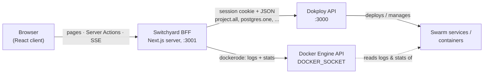

# Architecture

This doc explains how **Switchyard** — the Next.js dashboard in [`dashboard/`](../dashboard/) — is put together: the backend-for-frontend over the Dokploy API, the unified service model, Server Actions, the SSE log/metric streams, and the canvas. It is written for contributors changing dashboard code and for operators deciding how to deploy it. For installing the stack see [Getting started](getting-started.md); for using the features see the [Dashboard guide](dashboard-guide.md); for the Dokploy install scripts see [Launch tooling](launch-tooling.md).

Naming, used consistently below: **Switchyard** is this dashboard app; **Dokploy** is the upstream PaaS it drives.

## System overview

Switchyard is a Next.js 16 (App Router) server that sits between the browser and two upstream APIs. The browser never talks to Dokploy or Docker directly:



- **Control plane** (create, deploy, configure, destroy): the BFF calls Dokploy's RPC-style HTTP endpoints (`project.all`, `<engine>.one`, `application.create`, ...) from [`src/lib/dokploy.ts`](../dashboard/src/lib/dokploy.ts).
- **Data plane** (live logs and metrics): the BFF reads the Docker Engine API directly via [`src/lib/docker.ts`](../dashboard/src/lib/docker.ts) — the same engine the Dokploy stack runs on.

**Deployment topology.** Switchyard runs either from source (`npm run dev`, dev mode) or — the default the [CLI](cli.md) sets up — as a container built from [`dashboard/Dockerfile`](../dashboard/Dockerfile) (Next.js standalone output). The container joins `dokploy-network` and reaches Dokploy by service DNS (`DOKPLOY_URL=http://dokploy:3000`, so the host-published port is irrelevant), mounts `/var/run/docker.sock` for the data plane, and publishes 3001 on **127.0.0.1** unless explicitly exposed. `/api/health` reports liveness; `/api/health?deep=1` additionally proves the container → Dokploy sign-in path — the CLI gates on it after every (re)create.

One subtlety in container mode: Dokploy's auth layer (better-auth) validates the `Origin` header against its *host-facing* origins, so the service-DNS URL is rejected (`403 INVALID_ORIGIN`). The BFF therefore sends a configurable origin — `DOKPLOY_ORIGIN`, which the CLI sets to `http://localhost:<dokploy-port>` — while still connecting over service DNS. In dev mode `DOKPLOY_ORIGIN` is unset and the origin defaults to `DOKPLOY_URL`, the previous behavior.

## Why a backend-for-frontend

The BFF exists so that credentials never reach the browser. [`src/lib/dokploy.ts`](../dashboard/src/lib/dokploy.ts) is server-only:

- **Per-user session sign-in.** The user's `/login` POST goes to Dokploy's `/api/auth/sign-in/email`; the returned Dokploy cookie is trimmed to its `name=value` pairs and sealed inside the encrypted Switchyard session cookie (see the security model below). The raw Dokploy cookie and the user's credentials never reach the browser.
- **Request wrapper.** Every call goes through `request()`, which reads the current user's Dokploy cookie from the request context (`next/headers`) and sends JSON with `cache: "no-store"`, so Next never caches Dokploy responses. On a `401` the user's Dokploy session has expired and they are redirected to `/login` — there is deliberately no silent fallback to an admin session.
- **System probe.** The env admin credentials (`DOKPLOY_EMAIL` / `DOKPLOY_PASSWORD`) power only `ping()` behind `/api/health?deep=1`, so the installer can verify the container → Dokploy path before anyone has logged in.
- **Upgrade path.** Dokploy also supports an `x-api-key` token, gated behind the member `canAccessToAPI` permission. Switching to it means changing only `request()`; no caller is touched.

## Data model and service listing

Dokploy nests everything under **project → environment → services**. Switchyard flattens that into one union type (in `dokploy.ts`):

```ts
type Service = Database | Application | ComposeService; // discriminated on `kind`
```

All three share `ServiceBase`: id, name, `appName` (the Swarm service name), status (`idle | running | done | error`), project/environment scope, docker image, raw env block, CPU/memory limits, replicas. Databases add engine-specific fields (credentials, external port); applications add source, domains and deployment history; compose adds the compose file.

Databases come in five engines — `postgres`, `mysql`, `mariadb`, `mongo`, `redis` — and every Dokploy database endpoint keys on `<engine>Id` (`postgresId`, `mysqlId`, ...), which `idKey()` derives.

`loadWorkspace()` assembles the whole workspace from a single tree fetch:

1. `project.all` returns the project/environment tree, but with nested service objects **trimmed down to their ids**.
2. `collectIds()` flattens the tree into per-service refs, each carrying its project/environment scope.
3. Each ref is **enriched in parallel** (`Promise.all`) via the matching detail endpoint: `<engine>.one` for databases, `application.one` for apps, `compose.one` for compose stacks.
4. The three lists are merged, sorted by name, and returned together with the project tree.

This is a deliberate N+1 fan-out — one detail request per service — which is fine at dashboard scale and keeps the client dumb: [`src/app/page.tsx`](../dashboard/src/app/page.tsx) just calls `loadWorkspace()` and hands `services`, `projects`, and inferred `edges` to the client-side `Workspace` component.

`page.tsx` exports `dynamic = "force-dynamic"`, so the page is rendered per request from live Dokploy state (verified against the bundled Next 16 docs: `force-dynamic` forces request-time rendering). If `loadWorkspace()` throws — Dokploy down, bad credentials — the page renders an inline error panel showing the message and pointing at `DOKPLOY_URL` / `DOKPLOY_EMAIL` / `DOKPLOY_PASSWORD` in `.env.local` instead of crashing.

## Server Actions and cache revalidation

All mutations live in [`src/app/actions.ts`](../dashboard/src/app/actions.ts), a `"use server"` file — every export is a Server Function that client components import and call directly (Next 16 calls these Server Functions; "Server Actions" is the familiar name). Two wrappers give every action the same shape:

- `wrap(fn)` runs the mutation, calls `revalidatePath("/")`, and normalizes failures into `{ ok: false, error }` — so tabs and menus render errors inline instead of tripping error boundaries.
- `wrapId(fn)` does the same but returns the created service's id, so the UI can immediately open its drawer.

`revalidatePath("/")` invalidates the cached page; because the action is a Server Function, the UI updates in the same round trip when the affected path is being viewed. Client code additionally calls `router.refresh()` after quick-deploys (in `Workspace.onDeployed`) to re-fetch Server Components without losing client state — e.g. so the freshly opened drawer fills in as the new service appears.

The action surface, one line each:

| Group | Actions |
|---|---|
| Quick deploy | `quickDeployDatabaseAction` (random name + password, latest engine version, then deploy), `quickDeployImageAction` (Docker image), `quickDeployRepoAction` (public Git repo, Nixpacks build), `createComposeAction` (starter YAML) |
| Lifecycle | `lifecycleAction` / `appLifecycleAction` / `composeLifecycleAction` — `deploy`, `start`, `stop`, `remove` (compose maps `remove` to Dokploy's `compose.delete`) |
| Settings | `updateDatabaseAction` (reloads the container when image/resources/port change), `updateApplicationAction` (optional redeploy), `saveComposeFileAction` |
| Env vars | `saveEnvironmentAction` (databases), `saveApplicationEnvAction` |
| Domains | `createDomainAction` — `domain.create` with `https: true` and Let's Encrypt; app quick-deploys additionally call `ensureAutoDomain` to mint a public URL automatically (see below) |
| Projects | create/rename/remove project and environment |

Quick deploys route through `resolveTargetEnv()`: if no environment is picked and none exists, it creates a default "My Project" (Dokploy auto-creates its default environment) and deploys there.

### Auto-URL: a public URL on app deploy

`quickDeployRepoAction` / `quickDeployImageAction` mint a reachable URL right after kicking off the deploy, so an app has a Public URL with no manual DNS. `ensureAutoDomain()` (in `dokploy.ts`) is gated on the `SWITCHYARD_HOST_IP` env var — set only on the Linux path where Dokploy's Traefik owns 80/443. Its logic:

1. Prefer Dokploy's built-in `domain.generateDomain`, which returns a `*.traefik.me` host (`<appName>-<rand>.<hostIP>.traefik.me`) that resolves to the host IP with no DNS. traefik.me is served over a shared cert, so the domain is created with `certificateType: "none"`.
2. Fall back to `<appName>.<SWITCHYARD_HOST_IP>.sslip.io` (sslip.io resolves any embedded IP) with a real Let's Encrypt cert, when Dokploy can't produce a usable host.

It is idempotent — if the app already carries a `*.traefik.me`/`*.sslip.io` domain it returns that host instead of creating a second one — and best-effort: a failure to mint the URL never fails the deploy (the app is just left domain-less). The minted domain is created with HTTPS, so the Overview tab elects it as the Public URL. On **Docker Desktop and in dev mode `SWITCHYARD_HOST_IP` is unset**, so auto-URL is a documented no-op (Traefik is unmanaged there and domains wouldn't route); add a domain by hand in the Domains tab if needed.

## Live logs and metrics over SSE

Dokploy streams logs and stats to its own UI over WebSockets. Switchyard does not reverse-engineer that transport — the BFF runs on the same host as the Docker engine, so it reads containers directly through the Docker Engine API ([`src/lib/docker.ts`](../dashboard/src/lib/docker.ts), using `dockerode`) and re-serves them to the browser as Server-Sent Events.

**appName → container mapping.** A Dokploy service's `appName` is the prefix of its Swarm task container name. `findContainerId()` lists running containers filtered by name, prefers one whose name actually starts with the `appName`, and falls back to the first match.

**Logs** ([`/api/services/logs`](../dashboard/src/app/api/services/logs/route.ts)): `followLogs()` attaches to `container.logs()` with `follow`, `stdout`, `stderr`, `timestamps`, and a tail of 300 lines. Docker multiplexes stdout and stderr onto one stream, so the raw stream is **demuxed** via `container.modem.demuxStream()` into a single `PassThrough`. The route strips each line's leading RFC 3339 timestamp into a `ts` field and emits `data: {"ts","text"}` events. If no container is running, it sends a single placeholder line instead of erroring.

**Metrics** ([`/api/services/metrics`](../dashboard/src/app/api/services/metrics/route.ts)): `followStats()` attaches to `container.stats({ stream: true })`, which emits one JSON sample per interval. `toSample()` converts each into `{ts, cpu, memUsed, memLimit, memPct}` — CPU% from the usage delta over the system delta scaled by online CPUs, memory as usage minus page cache. If no container is running, the route emits a one-shot `event: idle` so the tab can show "not running" instead of an empty chart.

Shared plumbing lives in [`src/lib/sse.ts`](../dashboard/src/lib/sse.ts): SSE headers, line-buffering of the source stream, and teardown — the Docker stream is destroyed when the source ends/errors or when the client disconnects (`request.signal` abort), so closing a drawer tab detaches from the engine.

Both routes export `runtime = "nodejs"` (dockerode needs Node APIs) and `dynamic = "force-dynamic"`. On the client, `LogsTab` and `MetricsTab` are plain `EventSource` consumers: logs keep a capped buffer (trimmed from 2000 back to 1500 lines) with client-side filtering and stick-to-bottom scrolling; metrics keep the last 60 samples in Recharts area charts.

**`DOCKER_SOCKET`.** The socket path defaults to `/var/run/docker.sock` and can be overridden with the `DOCKER_SOCKET` env var. On Windows, Docker Desktop exposes the engine on a named pipe instead — set:

```dotenv
DOCKER_SOCKET=//./pipe/docker_engine
```

## Observability persistence and alerts

Live SSE (above) evaporates when a tab closes. For durable history and
crash-loop alerting Switchyard persists to a dedicated **`switchyard-metrics`
Postgres**, provisioned by the CLI on `dokploy-network` (`--endpoint-mode dnsrr`
on Linux, via [`scripts/switchyard-store-up.sh`](../scripts/switchyard-store-up.sh)).
The dashboard reaches it by service DNS through `SWITCHYARD_STORE_URL`, whose
password is generated once (CSPRNG) into the CLI config and folded into the
container config-hash so `up` stays idempotent. When the URL is unset (dev
mode), persistence is simply off and live behaviour is unchanged.

- **Store** ([`src/lib/store.ts`](../dashboard/src/lib/store.ts), `pg`): creates
  its tables on first use (`metric_samples`, `log_lines`) and exposes
  write/time-range-query/prune functions. Store errors are logged once and
  swallowed, never surfaced to the render path.
- **Collector** ([`src/lib/collector.ts`](../dashboard/src/lib/collector.ts)): a
  lazy singleton started on first workspace render (`ensureCollector()` in
  `page.tsx`). Every interval it samples stats and tails logs for *all* known
  services — tab open or not — writes rollups, and feeds a crash-loop detector.
- **History API** ([`/api/services/metrics/history`](../dashboard/src/app/api/services/metrics/history/route.ts)):
  queries rollups over a time range; `MetricsTab` seeds from it (so history
  survives a closed drawer) and offers a range selector, falling back to
  live-only when the store is off.
- **Alerts**: the crash-loop detector ([`src/lib/crash-loop.ts`](../dashboard/src/lib/crash-loop.ts))
  fires when a service Dokploy expects up is missing/restarting/dead (or its
  Docker RestartCount climbs) for N consecutive samples. Delivery reuses
  Dokploy's **existing** notification channels: `notification.all` yields the
  configured webhook (Slack/Discord/Telegram/Mattermost/Lark/Teams/custom) and
  the alert is POSTed there — no new notification infra.

## Canvas: edge inference and layout persistence

The Railway-style canvas ([`src/components/canvas/FlowCanvas.tsx`](../dashboard/src/components/canvas/FlowCanvas.tsx), built on React Flow / `@xyflow/react`) renders one node per service and draws arrows between related services.

**Edge inference** (`inferEdges()` in `dokploy.ts`). Dokploy has no native "connection" concept, so edges are a heuristic over env vars: if service A's raw env block contains service B's `appName` or `name` (case-insensitive substring, needles longer than 2 characters to cut noise), an edge A → B is drawn, deduplicated by pair. In practice this catches the common case — a `DATABASE_URL` whose host is the database's `appName` — but as a substring match it can produce false positives. Edges render animated, stroked in the *target* service's accent color.

**Default layout.** Nodes are grouped by `project / environment`: each group gets a column (320 px apart) with a non-draggable label node on top, and services stack in 104 px rows.

**Layout persistence** — as implemented, not a server feature: positions are stored **in the browser's `localStorage`** under the key `switchyard:positions`, so the arrangement is per-browser and never written to Dokploy. The mechanics in `FlowCanvas`:

- `buildNodes()` applies saved positions on top of the computed default layout.
- When a drag ends (React Flow reports a `position` change with `dragging: false`), the positions of **all** current service nodes are rebuilt from canvas state and written back wholesale — which also prunes entries for services that no longer exist.
- When fresh server data arrives (services added/removed, statuses changed), an effect rebuilds nodes and edges while carrying over the in-session positions, so a background refresh never scatters the layout.

Clicking a node (or a card in the grid view) opens the service drawer.

## Engine metadata

[`src/lib/engines.ts`](../dashboard/src/lib/engines.ts) holds per-engine display and provisioning metadata (`ENGINE_META`): label and short label, Docker image base plus a curated version list, an accent color, `hasDatabaseName` / `hasUser` flags (Redis takes neither; Mongo takes no database name), and the default in-container port. It feeds:

- **Quick deploy** — new databases get `${image}:${versions[0]}` (the newest listed version).
- **Settings** — the version dropdown offers exactly the curated tags.
- **Connection strings** — [`src/lib/connection.ts`](../dashboard/src/lib/connection.ts) builds the *internal* URL as `appName:defaultPort`, since other services reach a database by its Swarm service name on the overlay network. A configured `externalPort` is published on the **host**, so it is deliberately not used in the internal string.

## Service drawer

[`src/components/service/ServiceDrawer.tsx`](../dashboard/src/components/service/ServiceDrawer.tsx) shows kind-specific tab sets:

| Kind | Tabs |
|---|---|
| Database | Overview (lifecycle, connection string, facts) · Variables · Metrics · Logs · Settings (name, version, external port, CPU/mem, password reveal, danger zone) |
| Application | Overview · Variables · Domains (attach host, auto-SSL) · Deploys (history) · Metrics · Logs · Settings |
| Compose | Overview · Compose (YAML editor with save & deploy) · Logs · Settings |

Metrics and Logs tabs are keyed by `appName` and mount their `EventSource` only while active.

## Security model — per-user Dokploy login

Every route, Server Action, and SSE stream is gated by [`src/proxy.ts`](../dashboard/src/proxy.ts) (Next 16's successor to the `middleware` file convention). The allowlist is `/login`, `/api/health` (the installer's probe), and static assets; everything else requires a valid Switchyard session — pages get a 302 to `/login`, API routes and Server Actions get a 401.

Sessions work like this: the user signs in at `/login` with their **own Dokploy account**; the BFF forwards the credentials to Dokploy's `/api/auth/sign-in/email` and seals the returned Dokploy session cookie inside an AES-256-GCM-encrypted, HttpOnly, SameSite=Lax Switchyard cookie (key: `SWITCHYARD_SESSION_SECRET`, seeded by the CLI). Each request THAT user makes rides their own Dokploy session (`request()` → `userCookie()`); on a Dokploy 401 the user is bounced to `/login`. The env admin credentials serve exactly one purpose — the `/api/health?deep=1` installer probe — and never serve user requests. The logs/metrics routes additionally validate `?app=` against the set of Dokploy-managed `appName`s before touching the Docker socket, so a signed-in user cannot tail arbitrary host containers.

> **Warning — a login gate is not TLS.** The dashboard speaks plain HTTP, and any signed-in Dokploy user holds full admin (the drawer shows database passwords). Keep it bound to localhost (the default), or put an HTTPS reverse proxy in front before exposing it to any network you don't fully trust. See [Troubleshooting](troubleshooting.md) for network/exposure issues.

## Bundling note: `serverExternalPackages`

[`next.config.ts`](../dashboard/next.config.ts) opts `dockerode`, `docker-modem`, `ssh2`, and `cpu-features` out of server bundling:

```ts
const nextConfig: NextConfig = {
  serverExternalPackages: ["dockerode", "ssh2", "docker-modem", "cpu-features"],
};
```

`dockerode` pulls in `docker-modem` → `ssh2`, which ships a native asset that Turbopack cannot bundle. Since Switchyard only ever talks to the local Docker socket (no SSH transport), these stay runtime-external and are loaded with native Node `require` — which is precisely what `serverExternalPackages` does per the Next 16 docs.

## Configuration reference

| Env var | Default | Meaning |
|---|---|---|
| `DOKPLOY_URL` | `http://localhost:3000` | Dokploy base URL |
| `DOKPLOY_EMAIL` | — | Dokploy admin email (BFF sign-in) |
| `DOKPLOY_PASSWORD` | — | Dokploy admin password |
| `DOCKER_SOCKET` | `/var/run/docker.sock` | Docker Engine socket; `//./pipe/docker_engine` on Windows |
| `SWITCHYARD_HOST_IP` | — | Host public/advertise IP. When set, app deploys mint an auto-URL (traefik.me / sslip.io) with no DNS. Unset = auto-URL disabled (dev / Docker Desktop). The CLI sets it on Linux. |
| `SWITCHYARD_STORE_URL` | — | Postgres URL for durable metrics/logs. Unset = persistence off (dev). Set by the CLI to the `switchyard-metrics` service. |
| `SWITCHYARD_ALERTS` | on | Crash-loop alerting; `0`/`false`/`off` disables it. |
| `SWITCHYARD_ALERT_NOTIFICATION` | first | Which Dokploy notification channel to alert through (name or id). |
| `SWITCHYARD_ALERT_RESTART_THRESHOLD` | `3` | Consecutive unhealthy samples before a crash-loop alert fires. |
| `SWITCHYARD_COLLECT_INTERVAL_MS` | `20000` | Server-side collector sampling interval. |

Set them in `dashboard/.env.local` (template: `dashboard/.env.example`). The dev and prod servers both bind port **3001** (`next dev -p 3001` / `next start -p 3001`), since Dokploy owns `:3000`.
